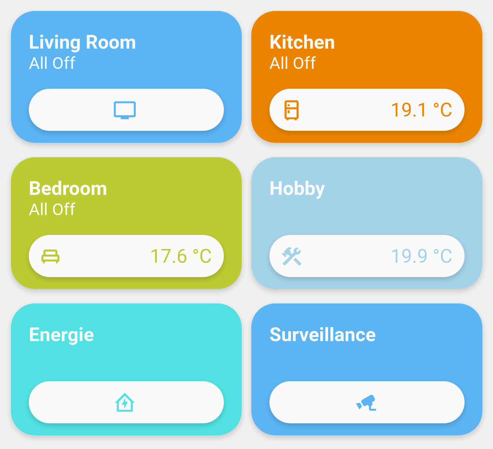

# Card_Room

An other alternative Room card desing 



## ToDo:

- [x] Basic Card
- [x] Theme intergration
- [x] Option to change background color
- [ ] Better Theme intergration / static colors
- [ ] Translations
- [ ] more customization options

## Configuration:

| Variable          | Default       | Required | Notes                              |
| ----------------- | ------------- | -------- | ---------------------------------- |
| room_path         |               | yes      | Path to an other view              |
| room_name         |               | yes      | Room name                          |
| room_icon         | mdi:alert-box | no       | Info icon                          |
| room_color        | #52E1E2       | no       | Custom background color            |
| room_info         | true          | no       | Temperture sensor or other sensor  |
| room_info_stuffix | °C            | no       | Stuffix to be added after the info |
| room_lights       |               | no       | Sensor whit light on count *       |

## Sample:

```yaml
- type: custom:button-card
  template: card_room
  variables:
    room_path: kitchen
    room_name: Kitchen
    room_icon: mdi:fridge-outline
    room_color: "#EB8500"
    room_info: "sensor.temperature_18"
    room_info_stuffix: "°C"
    room_lights: sensor.kitchen_lights_on
```

*This configuration needs an custom sensor being created in your config